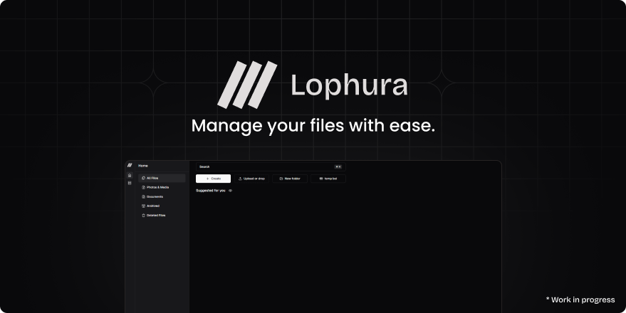

<div align="center">
  <div>
    <a href="https://github.com/hexaaagon/lophura" target="_blank" rel="noopener">
      
    </a>
  </div>
</div>

<br />

Lophura provides a file managing web-based interface that acts like a file manager, CDN, and more.

## 🚀 Getting Started

> [!CAUTION]
> Lophura is still in really early stage and is not suitable for production use.

Lophura is still in really early stage. If you want to try it out, you must build Lophura yourself until official release is available.

### Building Lophura

To get started, you need to install [Node.js](https://nodejs.org/en/download/) (at least v18) and [pnpm](https://pnpm.io/installation).

1. Clone the repository and change directory: `git clone https://github.com/hexaaagon/lophura.git && cd lophura`
2. Install dependencies: `pnpm install`
3. Build Lophura: `pnpm build`
   
  <details>
  <summary> Windows User? </summary>

  Change the following files to make this work for you!

  **packages/server/package.json:**
  <details>
  <summary>Code</summary>

  ```json
  "scripts": {
    "build": "npm run switch:prod && node -e \"require('fs').rmSync('./dist', { recursive: true, force: true });\" && tsc --project tsconfig.server.json && tsc-alias -p tsconfig.server.json",
    "switch:dev": "node ../server/scripts/switchToSrc.js",
    "switch:prod": "node ../server/scripts/switchToDist.js",
    "dev": "node -e \"require('fs').rmSync('./dist', { recursive: true, force: true });\" && pnpm esbuild && tsc --emitDeclarationOnly --outDir dist -p tsconfig.server.json",
    "esbuild": "tsx ./esbuild.config.ts && tsc --project tsconfig.server.json --emitDeclarationOnly",
    "typecheck": "tsc --noEmit"
  },
  ```
  </details>

  **packages/file-system/package.json:**
  <details>
  <summary>Code</summary>

  ```json
  "scripts": {
    "build": "npm run switch:prod && node -e \"require('fs').rmSync('./dist', { recursive: true, force: true });\" && tsc --project tsconfig.server.json && tsc-alias -p tsconfig.server.json",
    "switch:dev": "node ../server/scripts/switchToSrc.js",
    "switch:prod": "node ../server/scripts/switchToDist.js",
    "dev": "node -e \"require('fs').rmSync('./dist', { recursive: true, force: true });\" && pnpm esbuild && tsc --emitDeclarationOnly --outDir dist -p tsconfig.server.json",
    "esbuild": "tsx ./esbuild.config.ts && tsc --project tsconfig.server.json --emitDeclarationOnly",
    "typecheck": "tsc --noEmit"
  },
  ```
  </details>
  </details>

4. Migrate database: `pnpm db:migrate`
5. Start Lophura: `pnpm start`
